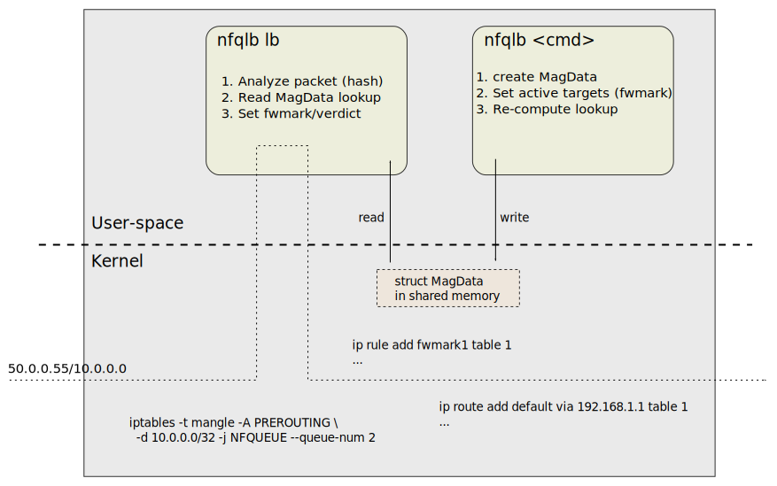
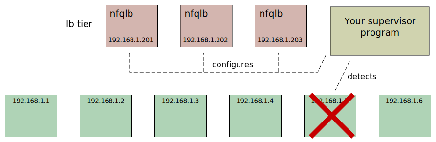

# Nordix/nfqueue-loadbalancer

A load-balancer based on the `NFQUEUE` iptables target. The `-j
NFQUEUE` target directs packets to a user-space program. The
program can analyze the packet and set `fwmark` and `verdict`.



The `nfqlb lb` program receives packets and uses a configuration in
shared memory to compute a `fwmark`. The `nfqlb` program invoked with
other commands configures the shared memory. This decouples the
traffic handling from configuration. For instance when a real-target
is lost it must be removed from the configuration with;

```
nfqlb deactivate 5
```

Automatic detection and re-configuration when a target (or
load-balancer) is lost/added is *not* a part of
`nfqueue-loadbalancer`. You must do that in your own way.




Hashing and fragment handling is done in the same way as the Google
load-balancer; [Maglev](maglev.md). `nfqlb` is stateless and since
the configuration is the same for all instances it does not matter where
packets are received. This makes `nfqlb` scalable.


The forwarding of packets is done by normal Linux routing, `nfqlb lb`
just sets a `fwmark`. That let you use any Linux function to route
packets to your targets. Example;

```
ip rule add fwmark 1 table 1
ip route add default via 192.168.1.1 table 1
```

### More info

* [Maglev](maglev.md) - How functions from the Google load-balancer is used
* [Fragment handling](fragments.md) - How fragmented packets are handled
* [Improved TCP performance](syn-only.md) - For TCP only `SYN` packets may be load-balanced
* [Fragment tracking](fragtrack.md) - With another hash table


## Build

```
make -C src help
make -C src -j8
./nfqlb.sh build_image    # Build the test docker image
```
Linked with `-lmnl -lnetfilter_queue` so you must install those.

Static binary;
```
./nfqlb.sh libnfqueue_download
./nfqlb.sh libnfqueue_unpack
./nfqlb.sh libnfqueue_build
make -C src clean
make -C src -j8 static
strip /tmp/$USER/nfqlb/nfqlb/nfqlb
file /tmp/$USER/nfqlb/nfqlb/nfqlb
```

## Try it locally

You must have some targets. We use docker containers, but anything
with an ip-address (not loopback) will do.

Bring up some container targets;
```
for n in 1 2 3; do
  name=target$n
  docker run -d --hostname=$name --name=$name --rm alpine:latest nc -nlk -p 8888 -e hostname
  docker inspect $name | jq .[].NetworkSettings.Networks.bridge.IPAddress
  #docker inspect $name | jq .[].NetworkSettings.Networks.bridge.GlobalIPv6Address
done
nc <addr> 8888   # Test connectivity
```

You *can* setup load-balancing in your main network name-space but
it is better to use another container. Build the test container and
enter. You must use `--privileged` for network configuration.

```
./nfqlb.sh build_image
docker run --privileged -it --rm nordixorg/nfqlb:latest /bin/bash
```

Use the `nfqlb.sh lb` script to setup load-balancing and check the
setup. Later you can make your own setup and/or check the `nfqlb.sh`
script.

In the test container;
```
PATH=$PATH:/opt/nfqlb/bin
nfqlb.sh lb --vip=10.0.0.0/32 <your container targets here...>
# Check load-balancing;
for n in $(seq 1 20); do echo | nc 10.0.0.0 8888; done
# Check some things
iptables -t nat -S    # OUTPUT chain for local origin, forwarding is not setup
iptables -t mangle -S # The VIP is routed to user-space
nfqlb show            # Shows the Maglev hash lookup
nfqlb deactivate 1    # Deactivates a target. Check load-balancing again!
```

This is a basic example. `nfqlb` can load-balance forwarded traffic
also (of course) and do Direct Server Return (DSR). This will however
require a different setup. But the setup in this example *can* be used
for IPv6. You must setup ipv6 support in `docker` and use ipv6
addresses for the VIP and targets in the `nfqlb.sh lb` command. But
that is left as an exercise for the reader :smiley:

You can also test with [xcluster](https://github.com/Nordix/xcluster)
in [ovl/load-balancer](https://github.com/Nordix/xcluster/tree/master/ovl/load-balancer).

