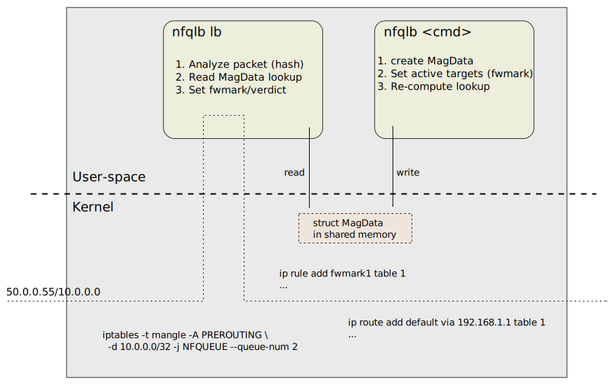

# nfqueue-loadbalancer

A load-balancer based on the NF_QUEUE iptables target

**[WIP]** Moved here from [ovl/load-balancer](https://github.com/Nordix/xcluster/tree/master/ovl/load-balancer)

The `-j NFQUEUE` iptables target directs packets to a user-space
program. The program can analyze the packet, set `fwmark` and place a
"verdict".

