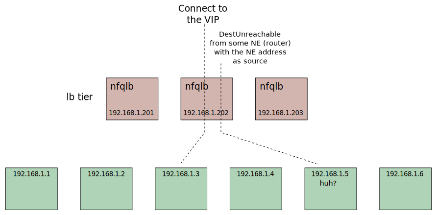
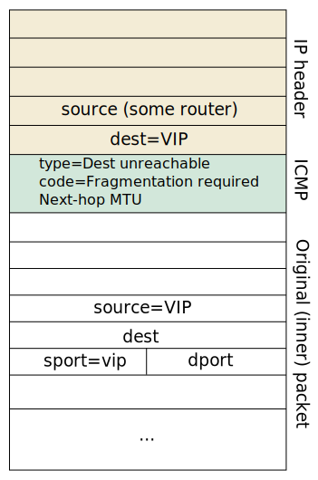

# Nordix/nfqueue-loadbalancer - Destination Unreachable and PMTU

Destination-unreachable and packet-too-big (for ipv6) icmp messages
are sent from a Network Entity (e.g. a router) with it's address as
source. This causes the icmp message to be load-balanced to the wrong
target.

This is particularly serious for fragment-needed (ipv4) and
packet-too-big (ipv6) messages. It prevents [PMTU
discovery](https://en.wikipedia.org/wiki/Path_MTU_Discovery) as
described in an excellent way by
[Cloudflare](https://blog.cloudflare.com/path-mtu-discovery-in-practice/).

But for both
[ipv4](https://en.wikipedia.org/wiki/Internet_Control_Message_Protocol#Destination_unreachable)
and [ipv6](https://datatracker.ietf.org/doc/html/rfc4443#section-3.2)
a part of the original message is included in the icmp message.

This "inner" packet contains the original addresses (and ports) and
`nfqlb` uses them to load-balance the icmp message to the correct
target. The included original message is a reply message so we must
flip addresses and ports before the hash.

