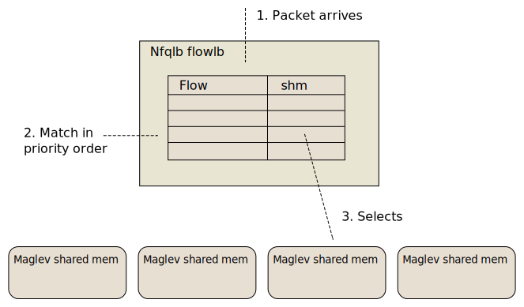

# Nordix/nfqueue-loadbalancer - Flows

A `flow` is defined by the 5-tuple; (proto,src,dst,sport,dport).

`nfqlb` can have multiple target load-balancers and there
is a mapping;

```
flow -> target load-balancer
```



The target load-balancer is identified by it's shared mem name. The
configuration of a target load-balancer is made in the same way as
without flows.

All items in a flow are sets. For ports that means multiple ports and
port ranges. For addresses that means multiple CIDR's.

The same fragmentation table, fragment injection `tun` device and
load-balancer tier is used by all target load-balancers.

Configuration example (nft/iptables config omitted);
```
# Start flow based load-balancer
nfqlb flowlb &
# Now the nfqlb is running without flows
# Create a target load-balancer
nfqlb init --shm=lb-1
nfqlb activate --shm=lb-1 101 103 103 104
# Add flows and tie them to the target load-balancer
nfqlb flow-set --name=flow-1 --prio=100 --targetShm=lb-1 --proto=udp,tcp \
  --dst=10.0.0.0/32,1000::/128 --dport=22,200-300,44,20000 \
  --src=2000::/64,192.168.2.0/24 --sport=20000-30000
nfqlb flow-set --name=flow-2 --prio=50 --targetShm=lb-1 --proto=sctp \
  --dst=10.0.0.0/32,1000::/128 --dport=4000 --udpencap=9899
nfqlb flow-list
nfqlb flow-delete --name=flow-2
```

There is no way to modify an existing flow, for instance removing a
port range, but a flow may be re-configured with an updated
configuration.

Unlike the lb-configuration (MaglevData) flows are stored in the lb
process and must be re-configured if the lb process is restarted.


## Performance

Flows are traversed one-by-one in priority order for each packet. With
many complex flows **the performance impact can be very large!**


## All-protocols flows

If no specific protocols are specified load-balancing is based on
addresses only (L3 level) and any (L4) protocol is accepted.


## Reject v.s. drop

If no flow matches or if the matched LB has no targets the packet is
dropped by default. If the packets shall be rejected instead you can use;

```
  --notargets_fwmark= Set when there are no targets 
  --nolb_fwmark= Set when there is no matching LB 
```
Then add reject rules in nft/iptables for these fwmarks.


## Ping

Normally `ping` only works with all-protocols flows but with the flag;

```
nfqlb flowlb --promiscuous_ping ...
```

ping will socialize with any flow with an address match. Ports and
protocols disregarded. Ping can be used but may not give the answer
you are looking for in case the same vip is used in many flows. For
example if flows vip:80, vip:5001, vip:6000 exists with the same prio
you can't know which flow ping will match.

**WARNING**: `--promiscuous_ping` adds a condition check in the flow
  match function that may affect performance.


## Udp encapsulated sctp

This is tricky since the udp encapsulation port is part of the flow
but it is needed for flow classification (a catch 22). The solution is
to add an extra flow for udp that catches the encapsulation port;

```
vm-201 ~ # nfqlb flow-list
[{
  "name": "#sctp",
  "priority": 100,
  "protocols": [ "udp" ],
  "dests": [
    "::ffff:10.0.0.0/128",
    "1000::/128"
  ],
  "dports": [
    "9899"
  ],
  "udpencap": 9899,
  "user_ref": "NULL"
},
{
  "name": "sctp",
  "priority": 100,
  "protocols": [ "sctp" ],
  "dests": [
    "::ffff:10.0.0.0/128",
    "1000::/128"
  ],
  "dports": [
    "6000"
  ],
  "udpencap": 9899,
  "user_ref": "nfqlb"
}]
```

The extra flow is added automatically and name is preceeded with `#`
which is an illegal character for user specified flows. When an
incoming udp packet matches a flow with an `udpencap` > 0 then a
re-classification of the flow is made which may match the sctp flow.


## Byte match

A flow can match on arbitrary bytes in the L4 header. The syntax is
the same as for `tcpdump` but with some limitations;

```
    proto[x,y] & z = V

 proto=tcp|udp|sctp, x=byte-offset, y=nbytes, z=mask (hex,optional)
 y may only be 1,2,4

 Regexp;
 "^(sctp|tcp|udp)\[[0-9]+ *: *[124]\]( *& *0x[0-9a-f]+)? *= *([0-9]+|0x[0-9a-f]+)$"
```

For example these match options are equivalent and will all match on
dport=5001;
```
 nfqlb flow-set --match="tcp[2:2] = 5001" ...
 nfqlb flow-set --match="tcp[0:4] & 0x0000ffff = 5001" ...
 nfqlb flow-set --match="tcp[2:1]=0x13, tcp[3:1]=0x89" ...
```


## The inner-packet problem

The original idea was to use iptables/nft to direct flows to different
`nfqlb` instances by selecting different nfqueues. That does however
not work for incoming icmp replies with an "inner-packet", e.g
"fragmentation needed" used in PMTU discovery, since iptables/nft does
not support rules for inner-packets.

This was a driving reason for introducing flows in `nfqlb`.

## Limitations

* No parameter argument may be longer than 1000 chars
  This puts constraints on the max name, port-ranges etc
* Name may only contain alphanum and "-+_".
* Cidrs <= 32. These are traversed in linear for each packet
* If ports are specified, protocols must also be specified
* Target is a file-name and is restricted by Linux to 255 chars
* Port ranges may not include the "any" port (0) or be above USHRT_MAX
* If udpencap is specified the protocols must be "sctp" (only)
