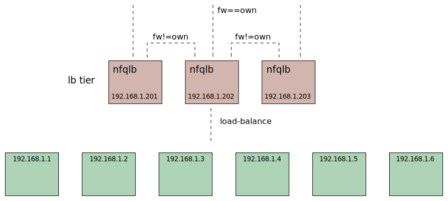
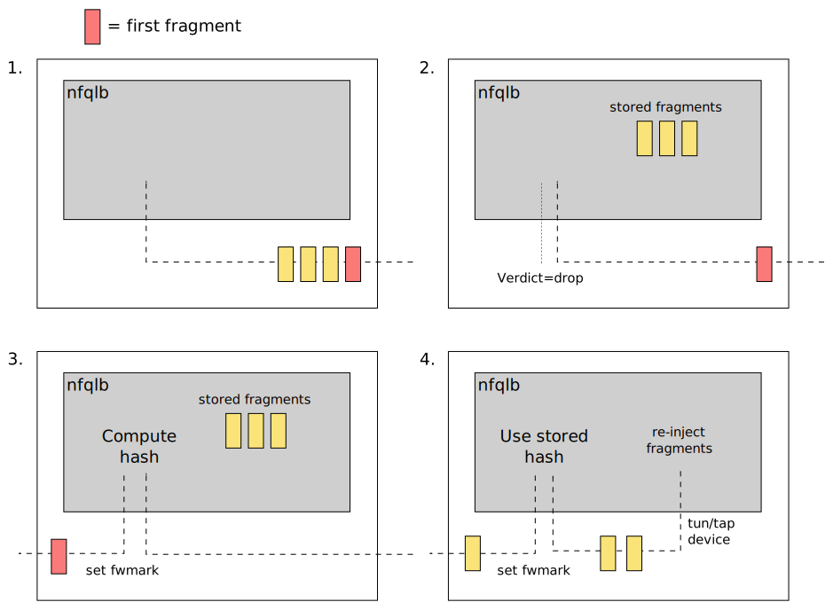

# Nordix/nfqueue-loadbalancer - Fragment handling

When a fragment arrive we hash on addresses only as described in the
[maglev document](https://static.googleusercontent.com/media/research.google.com/en//pubs/archive/44824.pdf).
If the lookup gives us our own fwmark we handle the fragment
locally. If not, route it to another load-balancer.





Now we have made sure that all fragments from a particular source ends
up in the same load-balancer. Here we do the L4 hashing, including
ports, and store the hash value in a [hash-table](fragtrack.md) with key
`<src,dst,frag-id>`. Subsequent fragments will have the same `frag-id`
and we retrieve the stored hash value.

If the fragments are re-ordered and the first fragment, with the ports,
does not come first we have no option but it store fragments until the
first fragment arrives.



1. The first fragment comes last

2. When we don't have a stored hash we copy the fragment in user-space
   and send `verdict=drop` so the kernel drops the original fragment.

3. When the first fragment arrives we compute and store the hash and
   load-balance the first fragment. We also initiate a re-inject of
   the stored fragments.

4. The stored fragments are injected to the kernel.  They are (again)
   redirected to user-space by the nfqueue but this time we have a
   stored hash and the fragments are load-balanced.


The NFQUEUE does not support stored packets to be re-injected, so we
use a [tun](https://en.wikipedia.org/wiki/TUN/TAP) device.


## The unwanted re-assembly problem

If we *want* the `nfqlb` to handle fragments we must turn off
functions in Linux that will "help" you by doing packet
re-assembly. For instance:

* HW offload. The NIC or network driver will re-assembly packets.
  The upper layers (including nfqlb) may receive 64K packets.

* The Linux conntracker. If the Linux conntracker is used in a netns
  (including the main netns) packets are re-assembed by the kernel.

* OVS connection tracker. If the `openvswitch-switch` service is
  activated packets are re-assembled in *all* network name-spaces!


### The Linux conntracker

The problem is described
[here](https://unix.stackexchange.com/questions/650790/unwanted-defragmentation-of-forwarded-ipv4-packets).

This also means that if DNAT (uses conntrack) based load-balancing is
used `nfqlb` can't handle fragments.

Before linux-5.13 if the Linux conntracker has *ever* been used in a
netns (including the main netns) packets are re-assembed by the
kernel forever. In linux-5.13 the re-assembly seem to be disabled
if all CT rules are removed from iptables.

We must have a way to detect if the re-assembly functions are
active. You *can* test on real HW, and eventually you must, but for
test we use [xcluster](https://github.com/Nordix/xcluster) described
in the nfqlb
[function-test](https://github.com/Nordix/nfqueue-loadbalancer/tree/master/test#function-test).

```
XOVLS='' xc mkcdrom xnet iptools
xc start --image=$XCLUSTER_WORKSPACE/xcluster/hd.img --nvm=2 --nrouters=0
# On vm-001;
iptables -t raw -A PREROUTING -i eth1 -j ACCEPT
iptables -t raw -Z PREROUTING
# On vm-002
ping -c1 -W1 -s 10000 192.168.1.1
# Back on vm-001
iptables -t raw -L PREROUTING -nv
iptables -t nat -A POSTROUTING -o eth1 -j MASQUERADE
# Re-test the ping
```

The listing shows the difference;
```
vm-001 ~ # iptables -t raw -L PREROUTING -nv
Chain PREROUTING (policy ACCEPT 9 packets, 503 bytes)
 pkts bytes target     prot opt in     out     source               destination
    7 10148 ACCEPT     all  --  eth1   *       0.0.0.0/0            0.0.0.0/0
# But with the MASQUERADE rule;
vm-001 ~ # iptables -t raw -L PREROUTING -nv
Chain PREROUTING (policy ACCEPT 7 packets, 399 bytes)
 pkts bytes target     prot opt in     out     source               destination
    1 10028 ACCEPT     all  --  eth1   *       0.0.0.0/0            0.0.0.0/0
```

The MASQUERADE rule has trigged the "conntrack" which re-assembles
packets. Note that you will still see all fragments with `tcpdump`.
The conntrack re-assembly take part later in the flow;


### HW offload

The HW offload can be configured and listed with the `ethtool`. In
virtual environment (VM) the network device (NIC) is almost certainly
virtual, e.g. `xcluster` uses "virtio", but even so it has (virtual)
HW offload.

```
ethtool -k eth1
...
tcp-segmentation-offload: on
        tx-tcp-segmentation: on
...
```

We use tcp and `nc` (netcat) to test;
```
XOVLS='' xc mkcdrom xnet iptools
xc start --image=$XCLUSTER_WORKSPACE/xcluster/hd.img --nvm=2 --nrouters=0
# On vm-001;
iptables -t raw -A PREROUTING -i eth1 -j ACCEPT
iptables -t raw -Z PREROUTING
nc -l -p 5000
# On vm-002
truncate -s 100K chunk
nc -w 1 192.168.1.1 5000 < chunk
# Back on vm-001
iptables -t raw -L PREROUTING -nv
# Turn off HW offload. On both VMs!!
ethtool -K eth1 gro off gso off tso off sg off
# (repeat the test)
```

With HW offload the packets are >MTU (1500). This will also be seen
with `tcpdump`.

```
# With HW offload;
Chain PREROUTING (policy ACCEPT 98 packets, 5147 bytes)
 pkts bytes target     prot opt in     out     source               destination
   14  103K ACCEPT     all  --  eth1   *       0.0.0.0/0            0.0.0.0/0
# HW offload disabled;
Chain PREROUTING (policy ACCEPT 91 packets, 4768 bytes)
 pkts bytes target     prot opt in     out     source               destination
   75  106K ACCEPT     all  --  eth1   *       0.0.0.0/0            0.0.0.0/0
```

On bare-metal this should be pretty stright forward, but in a virtual
environment it becomes complicated. You may have noticed that you must
turn off HW offload in the *client*. Why?? That's because the virtual
network used by `xcluster` (Linux bridge+tap) sectetly allows larger
MTUs. The linux bridge in the host OS may also [actively
reassemble](https://www.google.se/search?q=linux+bridge+reassemble)
packets itself unless you set sysctls;

```
net.bridge.bridge-nf-call-iptables = 0
net.bridge.bridge-nf-call-ip6tables = 0
```

I am sure there may be more problems in this area. It may be
impossible to get fragments to `nfqlb` in some virtual
environments. But in those cases the infra-structure owner has the
responsibility to deliver all fragments to the same place in correct
order.


## OVS connection tracker

To be investigated.

To just load the ovs kernel module does *not* trig re-assembly.
