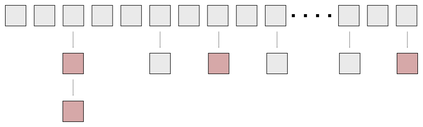

# Nordix/nfqueue-loadbalancer - Fragment tracking

We must track fragments, for example to store the computed (L4) hash
from the first fragment, also to store fragments out of order. The
fragment/connection tracker is implemented as a hash table;


The key is the tuple `{source, dest, fragid}`. This is the same, and
unique, for all fragments of a packet.

### Pools

All dynamically allocated objects, extra ctBuckets, FragData and
stored fragments, are taken from pre-allocated fixed size pools. This
prevents memory fragmentation caused by frequent malloc/free and puts
a limit on used resources.

### Locks

The entire table is *never* locked. Buckets are locked individually
and temporary when refered. The Bucket is *not* locked after return of
a `lookup()` operation. This means that the bucket may be freed when
the `FragData` is in use. To cope with this the `FragData` contains a
reference counter.

The mutex in `FragData` is used to protect the variables and is held
for very short times.

## TTL and GC

The prefered operation of `nfqlb` is to *never* explicitly remove
fragments from the table. All fragments times out.

Buckets have a Time-To-Live (ttl) and a time when they are last
refered (timeRefered). When

```
now - timeRefered > ttl
```

the bucket is "stale". It's data is outdated and it may be re-used.
When a bucket is refered (insert or lookup) a check is made of the
bucket, and it's linked buckets, and any stale buckets are re-claimed. A
Garbage Collect (GC) on refer of sorts.

This means that over time stale allocated buckets will be accumulated
at places in the table.



There is *no need* for an automatic (e.g. periodic) global GC!  The
laws of statistics and careful configuration is sufficient. This may
feel uncertain but fortunately it can be simulated.


## Configuration

The important parameters are;

* **ft_ttl** - Time to Live, but really *"maximum time between fragments of the same packet"*
* **ft_size** - The hash table size
* **ft_buckets** - Extra "ctBucket" on hash collisions


First we must decide a `ttl`. Ttl is really *"maximum time between
fragments of the same packet"*. Since fragments of the same packets
are normally (always?) sent as a burst from the source the ttl can be
set fairly low. In this example we set `ttl=200ms`. This is the time
in Linux for the first re-transmit of TCP packets so at least someone
thinks packets should not take more time.

Then we must decide a continuous rate of fragmented packets (packets
that is, not fragments) that we must handle. This metric is probably
not available so a rough estimate must do. We pick `rate=10000pkt/S`
in this example.

If hashing was perfect this would give a table size of;
```
ft_size = rate * ft_ttl
hsize = 10000 * 0.2 = 2000 in our example.
```

But we will get collisions so we must have the pool for extra buckets
and use a larger table. The recommended formula is;

```
ft_size = rate * ft_ttl * C
ft_buckets = ft_size
```

The value of `C` can be found with simulations;
```
make -j8 -C src test_progs
alias ct=/tmp/$USER/nfqlb/lib/test/ct-test
ct -h
ct --repeat=1 --duration=300 --rate=10000 --ft_ttl=200 --ft_size=2000 --ft_buckets=2000
{
  "ttlMillis":     200,
  "size":          2000,
  "active":        2002,
  "collisions":    1892035,
  "inserts":       3000180,
  "rejected":      25668,
  "lookups":       0,
  "objGC":         2972510,
  "bucketsMax":    2000,
  "bucketsPeak":   2000,
  "bucketsStale":  1977,
  "percentLoss":   0.9
}
```

Here we run a simulation of 10000pkt/S rate for a simulated time of
300s (5m). With C=1 we get ~1% packet loss. A reasonable value may be
C=2. The simulation itself takes less than 1s.

