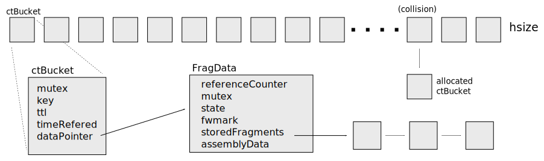

# Nordix/nfqueue-loadbalancer - Fragment tracking

We must track fragments, for example to store the computed (L4) hash
from the first fragment, also to store fragments out of order. The
fragment/connection tracker is implemented as a hash table;

The key is the tuple `{source, dest, fragid}`. This is the same, and
unique, for all fragments of a packet.

### Pools

All dynamically allocated objects, extra ctBuckets, FragData and
stored fragments, are taken from pre-allocated fixed size pools. This
prevents memory fragmentation caused by frequent malloc/free and puts
a limit on used resources.

### Locks

The entire table is *never* locked. Buckets are locked individually
when used. The Bucket is *not* locked after return of a `lookup()`
operation. This means that the bucket may be freed when the `FragData`
is in use. To cope with this the `FragData` contains a reference counter.

The mutex in `FragData` is used to protect the variables and is held
for very short times.

