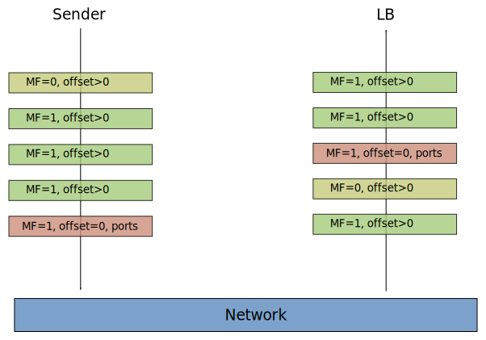

## The Google Maglev load-balancer

* https://static.googleusercontent.com/media/research.google.com/en//pubs/archive/44824.pdf

The `nfqueue-loadbalancer` uses a local implementation more or less
exactly as described in this document [maglev.c](src/lib/maglev.c).

The hash state is stored in "shared memory" so it is accessible from
the program doing load-balancing (`nfqlb lb`) as well as from programs
performing various configurations (`nfqlb <cmd>`);

```c
#define MAX_M 10000
#define MAX_N 100
struct MagData {
        unsigned M, N;
        int lookup[MAX_M];
        unsigned permutation[MAX_N][MAX_M];
        unsigned active[MAX_N];
};
```


The test program is rather crude but can be extended (by you);

```
make -j8 -C src test_progs
magtest=/tmp/$USER/nfqlb/lib/test/maglev-test
$magtest                # The example from p6 in the maglev doc
$magtest 20 5 1         # Shows permutation, lookup and a scale in/out
$magtest 20 5 1 10      # Test scale in/out and print % loss
$magtest 10000 10 1 10  # Larger M comes nearer to the ideal (10%)
```

### Fragment handling

Described in section 4.3 p8 in the
[maglev document](https://static.googleusercontent.com/media/research.google.com/en//pubs/archive/44824.pdf).

> Each Maglev is configured with a special backend pool consisting of
> all Maglevs within the cluster.

When a fragment is received a address hash is performend and the
packet is forwarded to a backend in this pool, i.e another
maglev. This maglev will get all fragments and maintain a state to
ensure all fragments are sent to the same backend.

> We use the GRE recursion control field to ensure that fragments are
> only redirected once.

In `nfqueue-loadbalancer` the `ownFwmark` is used instead.  If a
fragment would be forwarded to our selves we handle the packet locally.

Fragments can arrive in wrong order;



Only the firsts packet contain the ports. The fragments arriving
before the first fragment must be stored temporarily and re-sent when
the first fragment arrives. They can not be simply dropped since a
re-sent packet from the remote end may always arrive in the same
order.


