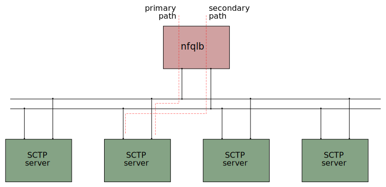
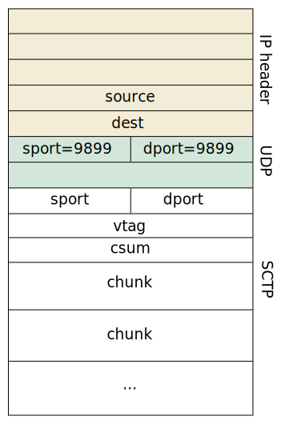

# Nfqlb with SCTP

Describes problems and solutions for load-balaning with multihomed
SCTP.

It is essential that all paths of an association ends up in the same
backend (server).

For a multihomed SCTP association the addresses (both source and dest)
are different for the paths but *the ports are always the same*. So
for SCTP the `nfqlb` hash on ports only.

The properties, such as scalability, are the same as for tcp/udp but
distribution will basically be based the on source port (since the
dest (server) port is the same).

DSR should be used since NAT can not be used without great
difficulties. From
[rfc3257](https://datatracker.ietf.org/doc/html/rfc3257#section-4);

> the NAT can have internal Application Layer Gateway (ALG) which will intelligently translate the IP addresses in the INIT and INIT ACK chunks

### SCTP over UDP

For SCTP over UDP hashing is still made of the SCTP ports.  The
encapsulation (UDP) port is specified with the `--sctp_encap=9899`
option to `nfqlb`. If a UDP packet with the specified port as
destination port arrives, hashing is made on the SCTP ports.

