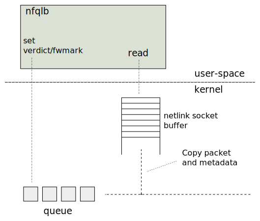

# Nordix/nfqueue-loadbalancer - testing

Unit tests are just local programs, function tests uses
[xcluster](https://github.com/Nordix/xcluster) and performance tests uses
a Docker container.

## Unit tests

Unit tests can be written in any way, no "framework" is imposed. Unit
test programs must exit with zero on success and non-zero on failure.

```
cd src
make clean; CFLAGS="-Werror" make -j8 test
make clean; CFLAGS="-DVERBOSE -DSANITY_CHECK -Werror" make -j8 test
```

Test programs are in `src/lib/test`. Any file with the pattern
`*-test.c` will be compiled and executed on `make test`. Currently
simple `assert`s are used.

### Dependency injection

The [dependency injection](https://en.wikipedia.org/wiki/Dependency_injection)
pattern is used to inject the current time, example;

```c
void* ctLookup(
    struct ct* ct, struct timespec* now, struct ctKey const* key);
```

This makes it possible to test anything down to nano-second level and
to do long virtual time simulations in really short real-time.


### Simulations

This is a special case of unit tests used to find a
configuration for the [fragtrack table](../fragtrack.md#configuration).


## Function test

Install [xcluster](https://github.com/Nordix/xcluster);
```
# Download the latest release, at least `v5.4.7`
tar xf ~/Downloads/xcluster-v5.4.7.tar.xz
cd xcluster
. ./Envsettings
nfqlb_dir=/your/path/to/Nordix/nfqueue-loadbalancer
export XCLUSTER_OVLPATH=$(readlink -f .)/ovl:$nfqlb_dir/test/ovl
```

The function test will use the
[mconnect](https://github.com/Nordix/mconnect) and
[ctraffic](https://github.com/Nordix/ctraffic) tests programs and the
*awsome* [jq](https://stedolan.github.io/jq/) utility.

```
curl -L https://github.com/Nordix/mconnect/releases/download/v2.2.0/mconnect.xz > $HOME/Downloads/mconnect.xz
curl -L https://github.com/Nordix/ctraffic/releases/download/v1.4.0/ctraffic.gz > $HOME/Downloads/ctraffic.gz
sudo apt install jq
```


Then proceed with the function tests in [ovl/nfqlb](ovl/nfqlb);
```
cdo nfqlb
log=/tmp/$USER/xcluster-test.log
./nfqlb.sh test > $log
```


## Performance test

We want to measure the impact on throughput, latency and packet loss
caused by the nfqueue. So we compare direct traffic and traffic
through the `nfqlb` to one single target.



Performance is affected by;

* The maximum queue length
* The size of packets (+meta-data) copied to the socket buffer
* The size of the socket buffer (SO_RCVBUF)

These values are logged on start-up;

```
queue_length=1024, mtu=1500, SO_RCVBUF=425984 (765952)
```

If the `nfqlb` program can't keep up we got two cases;

1. The socket buffer gets full (user drop)
2. The queue gets full (queue drop)

The former is will eventually happen on a sustained overload. The
later may happen on a burst of small packets, for instance on many
simultaneous TCP connects.

The only parameter you can control is the queue size, set by the
`--qlength=` option. The netlink socket buffer size (SO_RCVBUF) is
computed (approximately);

```
SO_RCVBUF = queue_length * mtu / 2
```

The max value of SO_RCVBUF may be restricted. The `mtu` is governed by
the MTU of the ingress interface but is set to 1280 if fragment
re-injection is not used (`--tun=` not set), because then we only need
to see the headers.


### Local performance test

The easiest way, and probably a quite good one, is to use the Docker
container we used in the example. Remember that we are not making HW
measurements here, we want to *compare* heavy traffic with and without
`nfqlb`. The `veth` pair between the container and main netns has a
max bandwidth at around 80 Gbit/second on my laptop ([measured with
iperf2](report-P8.md)).


We set our `docker0` device in main netns as the one target and run
`iperf` directly and to the VIP address. A problem is that the example
container uses DNAT so [fragment tests are not
possible](https://github.com/Nordix/nfqueue-loadbalancer/blob/master/fragments.md#the-unwanted-re-assembly-problem).

Manual test;
```
# Start an iperf server in main netns
iperf -s -V
# In another shell;
docker run --privileged -it --rm registry.nordix.org/cloud-native/nfqlb:latest /bin/sh
# (check the address of your Docker network, usually on dev "docker0")
# In the container;
PATH=$PATH:/opt/nfqlb/bin
docker0adr=172.17.0.1
nfqlb.sh lb --vip=10.0.0.0/32 $docker0adr
iperf -c $docker0adr
iperf -c 10.0.0.0
```

Iperf3 is not used since it's [not intended for use with load-balancers](https://github.com/esnet/iperf/issues/823).

Automatic test using the `nfqlb_performance.sh` script;
```
$ ./nfqlb_performance.sh test
1. Start iperf servers
2. Start the test container
3. Start LB
4. Iperf direct
------------------------------------------------------------
Client connecting to 172.17.0.1, TCP port 5001
TCP window size: 85.0 KByte (default)
------------------------------------------------------------
[  1] local 172.17.0.3 port 54718 connected with 172.17.0.1 port 5001
[ ID] Interval       Transfer     Bandwidth
[  1] 0.00-10.00 sec  54.6 GBytes  46.9 Gbits/sec
5. CPU usage 23.5%
6. Nfnetlink_queue stats
  Q       port inq cp   rng  Qdrop  Udrop      Seq
  2         72   0  2  1280      0      0        0
7. Re-start iperf servers
8. Iperf VIP
------------------------------------------------------------
Client connecting to 10.0.0.0, TCP port 5001
TCP window size: 85.0 KByte (default)
------------------------------------------------------------
[  1] local 172.17.0.3 port 44948 connected with 10.0.0.0 port 5001
[ ID] Interval       Transfer     Bandwidth
[  1] 0.00-10.00 sec  60.2 GBytes  51.7 Gbits/sec
9. CPU usage 28.9%
10. Nfnetlink_queue stats
  Q       port inq cp   rng  Qdrop  Udrop      Seq
  2         72   0  2  1280      0      0  1449321
10. Stop the container
```

There is no bandwidth degradation caused by `nfqlb` but there *is* a
CPU usage increase. At ~50 Gbits/sec it is ~6% which is acceptable. It
would also be lower on a more powerful machine than my Dell ultrabook.


### Parallel and multi-queue

You can start `iperf` with parallel connections ([report](report-P8.md)):
```
./nfqlb_performance.sh test -P8
```

Now direct traffic uses all cores (I have 8) and the throughput
becomes ~80 Gbits/sec. But via `nfqlb` the throughput stays at ~40
Gbits/sec. This because only a single thread handles packets in
`nfqlb`. Note that we get user-drops.

Multi-queue (and multi-thread) is supported by `nfqlb` but to get `-j
NFQUEUE --queue-balance` work properly the traffic must come from
different sources. After a
[discussion](https://sourceforge.net/p/iperf2/discussion/general/thread/3dcc4d673f/)
with the author of `iperf2` he kindly agreed to [add this
feature](https://sourceforge.net/p/iperf2/tickets/112/). The updated
`iperf2` is included in the pre-build image from version 0.1.1, and a
pre-built updated `iperf2` can be [downloaded](https://artifactory.nordix.org/artifactory/cloud-native/lib/iperf). ([report](report-P8-mqueue.md))

```
./nfqlb_performance.sh test --queue=0:3 --multi-src -P8
```

Direct traffic still is ~80Gbit/sec and via `nfqlb` we get
~70Gbit/sec. CPU usage is ~90% in both cases. Note that all queues
gets a share of the traffic and *there are no drops*.


### UDP

It is not simple to test UPD bandwidth with `iperf`. Basically you
have to set the bandwidth using the `-b` flag and check what happens
([report](report-udp2G.md));

```
./nfqlb_performance.sh test -b2G -u
```

If we try `-b4G` we can notice that direct access stays at ~3G while
traffic through `nfqlb` stays around ~2G ([report](report-udp4G.md)).

The difference compared to TCP feels too large. We must probably find
another tool for testing UDP bandwidth.


### On HW

Warning: To run `nfqlb.sh lb` in main netns may interfere with your
network setup.

You must install `nfqlb` on both machines. Either clone the repo and
build the binary or copy the necessary files;

```
scp /tmp/$USER/nfqlb/nfqlb/nfqlb nfqlb.sh test/nfqlb_performance.sh remote-machine:remote/path
# If you want to execute multi-queue tests;
scp $HOME/Downloads/iperf remote-machine:Downloads
```

Manual test;
```
# On the server machine (fd01::2)
iperf -s -V
# On the local machine (fd01::1)
sudo ./nfqlb.sh lb --path=. --vip=2000::1/128 fd01::2
iperf -V -c fd01::2      # direct
#ip -6 ro add 2000::1 via fd01::2 # (unless you have an ipv6 default route)
iperf -V -c 2000::1      # via nfqlb
sudo ip6tables -t mangle -nvL OUTPUT  # (just checking)
sudo ./nfqlb.sh stop_lb --path=/tmp/$USER/nfqlb/nfqlb --vip=2000::1/128 fd01::2
```
Note: You *must* have a route to the vip even though it's not used.

Test on a 1G interface shows ~800 Mbits/sec both with and without `nfqlb`.

Test using script
```
# On the server machine (fd01::2)
./nfqlb_performance.sh start_iperf_server
# On the local machine (fd01::1)
./nfqlb_performance.sh hw_test --serverip=fd01::2 --vip=2000::1/128
```

Test using script with multi-queue/multi-src;
```
# On the server machine (fd01::2)
./nfqlb_performance.sh start_server --gw=fd01::1
# On the local machine (fd01::1)
./nfqlb_performance.sh hw_test --multi-src --serverip=fd01::2 --vip=2000::1/128 -P8
```


### Fragmentation test

To test performance with fragmentation we can't use the test container
since it uses DNAT, we must setup an environment with Direct Server
Return (DSR) and avoid all conntrack related settings, and *uninstall
openvswitch*! We must also use `nfqlb` with forwarding which will add
an extra hop.


A network namespace (netns) is used, not a container. There should not
be any additional hop to the netns so a `macvlan` interface is created
and injected (rather than another veth pair).

Client `iperf` is executed in the main netns on `HW1`. Tests are
executed to the VIP address on `HW2` with and without `nfqlb`.

```
# Copy SW to the test machines
for target in hw1 hw2; do
  scp nfqlb_performance.sh ../nfqlb.sh $HOME/Downloads/iperf \
    /tmp/$USER/nfqlb/nfqlb/nfqlb $target:Downloads
done

# On hw1
cd Downloads
./nfqlb_performance.sh test_netns --iface=<your-interface>

# On hw2
cd Downloads
sudo ip -6 addr add fd01::10.10.0.0/127 dev <your-interface>
./nfqlb_performance.sh start_server --gw=fd01::10.10.0.1 --vip=fd01::2000/128
# NOTE! The iperf udp server tends to crash, so restart it if needed
$HOME/Downloads/iperf -s -V -B fd01::2000 --udp

# Back on hw1
./nfqlb_performance.sh dsr_test --direct --vip=fd01::2000 -P4 -u -b100M -l 2400
# (restart the servers on hw2!)
export __lbopts="--ft_size=10000 --ft_buckets=10000 --ft_frag=100 --ft_ttl=50"
./nfqlb_performance.sh dsr_test --vip=fd01::2000 -P4 -u -b100M -l 2400

# Clean-up on hw1
./nfqlb_performance.sh test_netns --iface=<your-interface> --delete
# Clean-up on hw2
killall iperf
sudo ip -6 route del fd01::10.200.200.0/120 via fd01::10.10.0.1
sudo ip -6 addr del fd01::2000/128 dev lo
```

This setup can also be tested in the [function test environment](ovl/nfqlb/README.md#test-the-hw-setup).


#### Local fragmentation test

We can also use a second netns for local testing.


This time there will be two hops over `veth` pairs.

```
export __lbopts="--ft_size=10000 --ft_buckets=10000 --ft_frag=100 --ft_ttl=50"
./nfqlb_performance.sh dsr_test_local --vip=10.0.0.0/32 -P4 -u -b100M -l 2400
./nfqlb_performance.sh dsr_test_local --vip=fd01::2000/128 -P4 -u -b100M -l 2400
```
